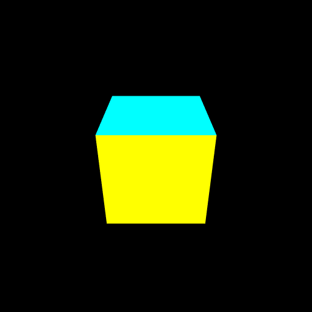

# インデックスバッファ
インデックス参照で頂点を描画します。

# 課題
次の問題に挑戦してみてください。

- 立方体の「頂点」ごとの色を付けてみよう

# 課題の進め方
次のように課題を解いてみてください。

- プロジェクトをforkします
- GitHub Pages の機能を使って、ホームページを立ち上げます
- 問題を解きます
- GitHub Pages で正答したか確認しましょう

